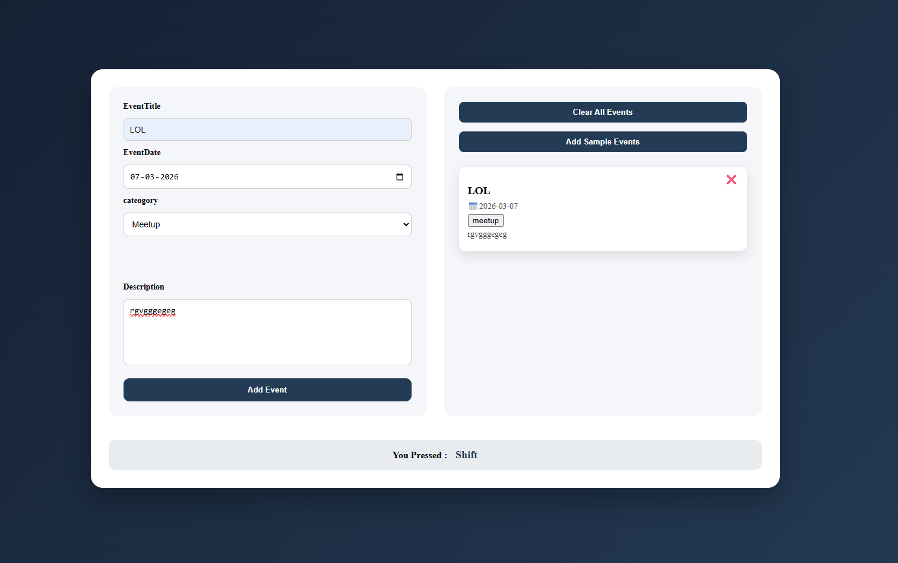
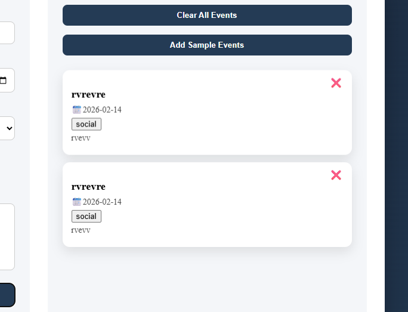
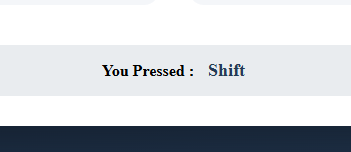

# 📅 Event Manager Web App

A simple Event Manager web application built using HTML, CSS, and JavaScript.

## 📸 Screenshots

### Main UI

### Adding Event

### Event Card

## 🚀 Features

- Add new events
- Delete events
- Select event category
- Choose event date
- Dynamic event cards
- Displays pressed keyboard key

## 🛠️ Technologies Used

- HTML
- CSS
- JavaScript (DOM Manipulation)

## 📂 Project Files

- `index.html` → Structure of the app
- `style.css` → Styling and layout
- `main.js` → Functionality and logic

## ▶️ How to Run

1. Download all files.
2. Keep them in the same folder.
3. Open `index.html` in your browser.

No installation required.

## 📌 Future Improvements

- Add LocalStorage support
- Add edit feature
- Add clear all functionality
- Add category filter

---

Created by Tanishq 🚀
